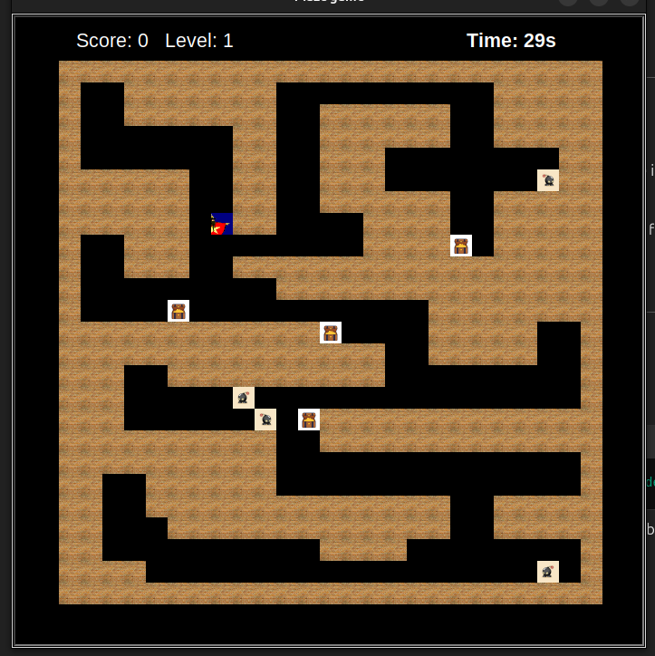

# Maze Dungeon Game

## Overview
Maze Dungeon Game is a Python-based maze game where the goal is for the player to navigate through a maze, collect as many treasures as possible, and avoid moving bombs. The game consists of 3 levels.

The game challenges players with time constraints and strategic movements to maximize their score while avoiding hazards.

## Features
- **Dynamic Maze Gameplay**: Navigate through a maze filled with treasures and bombs.
- **Moving Bombs**: Avoid the bombs as they move through the maze.
- **Scoring System**: Collect treasures to increase your score.
- **Time Limit**: Beat the maze within the given time frame.

## How to Play
1. Use the keyboard to move your player (typically arrow keys or WASD, depending on the implementation).
2. Collect as many treasures as possible to increase your score.
3. Avoid the bombs! If you collide with one, the game might end.
4. Race against the clock to complete the level.

## Installation
1. Ensure you have Python installed (Python 3.x is recommended).
2. Clone the repository:
   ```bash
   git clone https://github.com/Ayushi-Savla/maze_dungeon_game
   ```
3. Navigate to the project directory:
   ```bash
   cd maze_dungeon_game
   ```
4. Install the required dependencies:
   ```bash
   pip install -r requirements.txt
   ```

## Running the Game
Run the following command in the terminal to start the game:
```bash
python main.py
```

## Dependencies
The game requires the following Python modules:
- math (built-in)
- random (built-in)
- turtle (built-in)

Ensure you are running a Python version that supports these modules.

## Screenshots


## Contributing
If you'd like to contribute to the game, feel free to fork the repository and submit a pull request with your changes!


## Authors
Ayushi Savla
Victoria Mwaura
Abigail Kariuki
Mwenda Mugambi
Daniella Iseu
